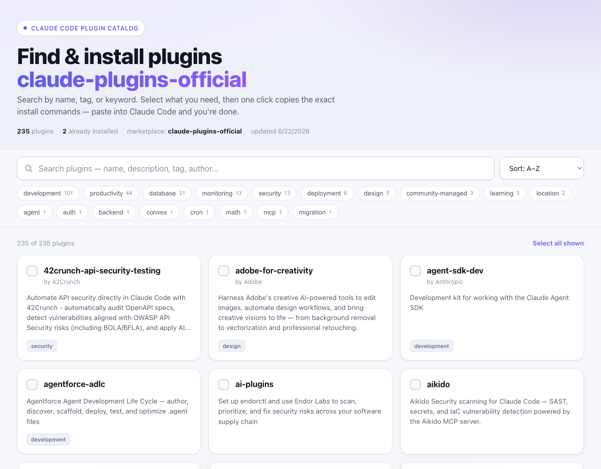

# Plugin Catalog

A beautiful, **backend-free** single-page app for browsing a Claude Code plugin
collection, searching by name/tag/keyword, selecting plugins, and **one-click
copying the install commands** into your project. Ships with a `plugin-catalog`
skill that scans any repo and regenerates the page.



## How it works

1. **Scan** a plugin repo → generates `data.js` (the catalog).
2. **Open** `index.html` → search, filter, select plugins.
3. **Install** → click *Install selected*; it copies the exact commands. Paste
   into Claude Code / your terminal from your project and run.

The browser is sandboxed (no backend), so the "1-click" copies the commands and
you paste-and-run — or you let the `plugin-catalog` skill run them for you.

## Quick start

```bash
# 1. Scan a marketplace repo (uses .claude-plugin/marketplace.json if present,
#    otherwise infers the catalog from folder structure)
node scripts/scan.mjs ~/.claude/plugins/marketplaces/claude-plugins-official \
  --source anthropics/claude-code

# 2. Open the page (file:// works — no server needed)
open index.html
#    …or serve it (also how GitHub Pages would host it):
python3 -m http.server 8000   # http://localhost:8000
```

## The skill

Ask Claude Code: *"scan this plugin repo and let me pick what to install"* and
the `plugin-catalog` skill (`.claude/skills/plugin-catalog/`) will:
- resolve the repo (local path or git URL — cloning if needed),
- run the scanner to refresh `data.js`,
- point you to the page, and
- optionally run the `claude plugin install … --scope project` commands directly.

Copy/symlink `.claude/skills/plugin-catalog` into `~/.claude/skills/` to use it
in any project.

## `scan.mjs` options

```
node scripts/scan.mjs <repo-path-or-.> [--source <owner/repo | git-url | path>]
                                       [--out <path/to/data.js>]
                                       [--no-installed]
```

- `--source` — what the page passes to `claude plugin marketplace add`. Defaults
  to the repo's git remote, then its absolute path.
- `--out` — where to write the catalog (default `./data.js`).
- `--no-installed` — skip reading `~/.claude/plugins/installed_plugins.json`
  (which is used to show "Installed" badges).

## Deploy to GitHub Pages

Push `index.html` + `data.js` to a repo and enable Pages — same files work
hosted or local. Re-run the scanner anytime to refresh the catalog.

## Files

| File | Purpose |
|------|---------|
| `index.html` | Self-contained SPA (HTML/CSS/JS, no build, dark-mode aware) |
| `scripts/scan.mjs` | Scans a repo → generates `data.js` |
| `data.js` | Generated catalog (`window.PLUGIN_CATALOG`) |
| `.claude/skills/plugin-catalog/` | The scan-and-install skill |
